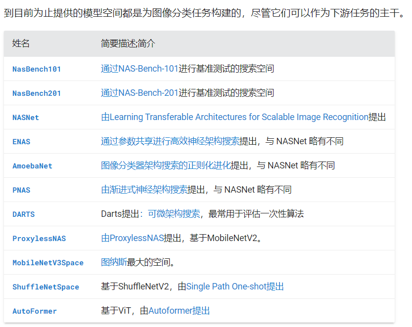
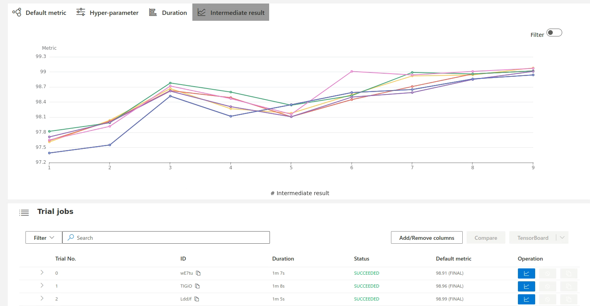
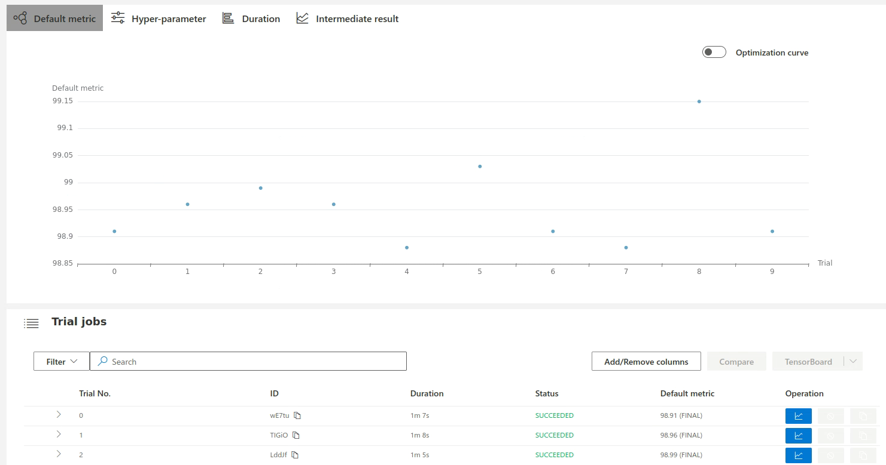

# NNI神经架构搜索

## 1.模型空间

NNI支持的模型空间有：



```
import torch
from nni.nas.hub.pytorch import MobileNetV3Space
from torch.utils.data import DataLoader
from torchvision import transforms
from torchvision.datasets import ImageNet

# Load one of the searched results from MobileNetV3 search space.
mobilenetv3 = MobileNetV3Space.load_searched_model(
    'mobilenetv3-small-100',        # Available model alias are listed in the table below.
    pretrained=True, download=True  # download and load the pretrained checkpoint
)

# MobileNetV3 model can be directly evaluated on ImageNet
transform = transforms.Compose([
    transforms.Resize(256, interpolation=transforms.InterpolationMode.BICUBIC),
    transforms.CenterCrop(224),
    transforms.ToTensor(),
    transforms.Normalize(mean=[0.485, 0.456, 0.406], std=[0.229, 0.224, 0.225])
])
dataset = ImageNet('/path/to/your/imagenet', 'val', transform=transform)
dataloader = DataLoader(dataset, batch_size=64)
mobilenetv3.eval()
with torch.no_grad():
    correct = total = 0
    for inputs, targets in dataloader:
        logits = mobilenetv3(inputs)
        _, predict = torch.max(logits, 1)
        correct += (predict == targets).sum().item()
        total += targets.size(0)
print('Accuracy:', correct / total)
```


## 2.搜索策略

### Multi-trial(多试验策略)

在模型空间中独立训练每个采样模型。多试验 NAS 意味着模型空间中的每个采样模型都是独立训练的。典型的多试验NAS是[NASNet](https://arxiv.org/abs/1707.07012)。在多试验 NAS 中，用户需要模型评估器来评估每个采样模型的性能，并且需要一种探索策略来从定义的模型空间中采样模型。在这里，用户可以使用 NNI 提供的模型评估器或编写自己的模型评估器。他们可以简单地选择一种探索策略。高级用户还可以定制新的探索策略。

```
import nni.nas.strategy as strategy
exploration_strategy = strategy.Random(dedup=True)
```


### One-shot(一次性策略)

从超级模型中对模型进行采样。一次性 NAS 算法利用神经架构搜索空间中模型之间的权重共享来训练超级网络，并使用该超级网络来指导选择更好的模型。与从头开始独立训练每个模型（我们称之为“多试验 NAS”）相比，这种类型的算法大大减少了计算资源。

```
import nni.nas.strategy as strategy
import nni.nas.evaluator.pytorch.lightning as pl
evaluator = pl.Classification(
  # Need to use `pl.DataLoader` instead of `torch.utils.data.DataLoader` here,
  # or use `nni.trace` to wrap `torch.utils.data.DataLoader`.
  train_dataloaders=pl.DataLoader(train_dataset, batch_size=100),
  val_dataloaders=pl.DataLoader(test_dataset, batch_size=100),
  # Other keyword arguments passed to pytorch_lightning.Trainer.
  max_epochs=10,
  gpus=1,
)
exploration_strategy = strategy.DARTS()
```

## 3.模型评估器

模型评估器用于训练和验证每个生成的模型。它们对于评估新探索的模型的性能是必要的。

### 自定义具有任何功能的评估器

```
from nni.nas.evaluator import FunctionalEvaluator
from nni.nas.experiment import NasExperiment

def fit(model, dataloader):
    train(model, dataloader)
    acc = test(model, dataloader)
    nni.report_final_result(acc)

# The dataloader will be serialized, thus ``nni.trace`` is needed here.
# See serialization tutorial for more details.
evaluator = FunctionalEvaluator(fit, dataloader=nni.trace(DataLoader)(foo, bar))
experiment = NasExperiment(base_model, lightning, strategy)
```

### 使用评估器来训练和评估模型

```
# Class definition of a model space, for example, ResNet.
class MyModelSpace(ModelSpace):
     ...

# Mock a model instance
from nni.nas.space import RawFormatModelSpace
model_container = RawFormatModelSpace.from_model(MyModelSpace())

# Randomly sample a model
model = model_container.random()

# Mock a runtime so that `nni.get_next_parameter` and `nni.report_xxx_result` will work.
with evaluator.mock_runtime(model):
    evaluator.evaluate(model.executable_model())

with model_context(exported_model_dict):
    model = MyModelSpace()
# Then use evaluator.evaluate
evaluator.evaluate(model)

# 或者使用
# MyModelSpace().freeze(exported_model_dict)
```

## 4.常用命令

### 4.1 运行

在第一次进行搜索的时候，需要敲命令生成搜索空间文件，这里我将其命名为ss.json

```
nnictl ss_gen --trial_command="python3 mnist.py" --trial_dir=./ --file=ss.json
```

编辑config_random_search.yml，设置searchSpacePath的具体路径：

```
authorName: default
experimentName: example_mnist
trialConcurrency: 1
maxExecDuration: 1h
maxTrialNum: 10
#choice: local, remote, pai
trainingServicePlatform: local
#please use `nnictl ss_gen` to generate search space file first
searchSpacePath: ss.json
useAnnotation: False
tuner:
  codeDir: ../../tuners/random_nas_tuner
  classFileName: random_nas_tuner.py
  className: RandomNASTuner
trial:
  command: python3 mnist.py
  codeDir: .
  gpuNum: 0
```

运行nas

```
nnictl create --config config_random_search.yml
```

结果：





### 4.2 区别

`Tuner`和`Sampler`都是用于自动调整模型超参数的组件，但它们的使用场景和功能有所不同

1. `Tuner`：`Tuner`主要用于神经网络模型的超参数优化。它提供了一种机制，可以自动地搜索最优的超参数组合，以提高模型的性能。`Tuner`可以根据前面试验的结果来调整后续试验的超参数，从而实现更有效的搜索。NNI提供了多种预定义的`Tuner`，如网格搜索、随机搜索、贝叶斯优化等，同时也支持用户自定义`Tuner`。
2. `Sampler`：`Sampler`是NNI在v2版本中引入的新概念，主要用于更广泛的自动机器学习（AutoML）场景，包括但不限于超参数优化。`Sampler`可以用于从给定的搜索空间中采样超参数，但它不会根据前面试验的结果来调整采样策略。`Sampler`更加通用，可以用于任何需要从某个空间中进行采样的场景，而不仅仅是超参数优化。
